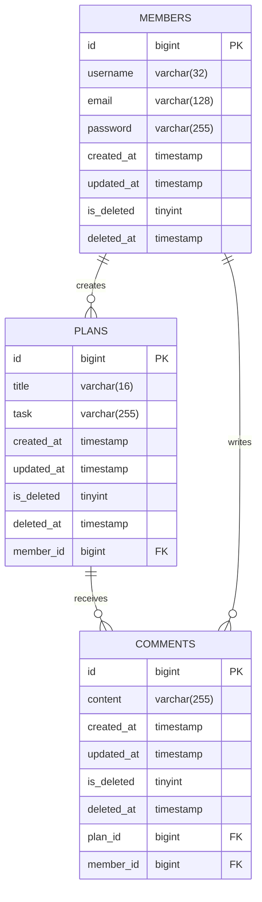

# 🗓️ Developing a Planner Application Using Spring Boot and JPA (Level Seven, Eight)

## 💻 Introduction
- This project is an assignment designed to evaluate students' understanding of the online lecture.
- The application is developed as a personal project.
- The application is designed with a console-based user interface.

## 📆 Development Period
- **Study**: 08/12/2024 – 13/12/2024
- **Development**: 13/12/2024 – 19/12/2024

## 🛠️ Tech Stack
- Java 17
- Spring Boot 3.4.0
- Spring Data JPA
- MySQL Driver
- BCrypt 0.10.2
- MySQL 9.1.0
- Lombok

## 🔗 ERD


### ERD Note
- The SQL database table name of `PLANS` is `plans7`.
- The SQL database table name of `MEMBERS` is `members7`.
- The SQL database table name of `COMMENTS` is `comments7`.

## 📜 API Specification
### Basic Information
- Base URL (member): /members
- Base URL (plan): /plans
- Base URL (comment): /comments
- Response Format: JSON
- Character Encoding: UTF-8

### API List
#### API Endpoints - Member

| Method | URI             | Description          | Request Body                  | Request Parameters | Path Variables | Response Code |
|--------|-----------------|----------------------|-------------------------------|--------------------|----------------|---------------|
| POST   | /members/signup | Sign up member       | `username` `email` `password` |                    |                | 201           |
| POST   | /members/signin | Sign in member       | `email` `password`            |                    |                | 200           |
| GET    | /members        | Read all members     |                               |                    |                | 200           |
| GET    | /members/{id}   | Read specific member |                               |                    | `id`           | 200           | 
| PUT    | /members/{id}   | Update member        | `username` `email`            |                    | `id`           | 200           |
| DELETE | /members/{id}   | Delete member        |                               |                    | `id`           | 200           |

#### API Endpoints - Plan
| Method | URI         | Description        | Request Body            | Request Parameters | Path Variables | Response Code |
|--------|-------------|--------------------|-------------------------|--------------------|----------------|---------------|
| POST   | /plans      | Create plan        | `title` `task` `userId` |                    |                | 201           |
| GET    | /plans      | Read all plans     |                         | `page` `size`      |                | 200           |
| GET    | /plans/{id} | Read specific plan |                         |                    | `id`           | 200           |
| PATCH  | /plans/{id} | Update plan        | `title` `task`          |                    | `id`           | 200           |
| DELETE | /plans/{id} | Delete plan        |                         |                    | `id`           | 200           |

#### API Endpoints - Comment
| Method | URI            | Description           | Request Body       | Request Parameters | Path Variables | Response Code |
|--------|----------------|-----------------------|--------------------|--------------------|----------------|---------------|
| POST   | /comments      | Create comment        | `content` `planId` |                    |                | 201           |
| GET    | /comments      | Read all comments     |                    |                    |                | 200           |
| GET    | /comments/{id} | Read specific comment |                    |                    | `id`           | 200           |
| PATCH  | /comments/{id} | Update comment        | `content`          |                    | `id`           | 200           |
| DELETE | /comments/{id} | Delete comment        |                    |                    | `id`           | 200           |


### API Details
#### Request Body Details - Member
1. **`POST` Create(Sign up) Member**
    ```json
    {
        "username" : "사용자 이름",
        "email" : "사용자 이메일",
        "password" : "비밀번호"
    }
    ```

2. **`POST` Create(Sign in) Member**
    ```json
    {
        "email" : "사용자 이메일",
        "password" : "비밀번호"
    }
    ``` 

3. **`PUT` Update Member**
    ```json
    {
        "username" : "수정하려는 사용자 이름",
        "email" : "수정하려는 사용자 이메일"
    }
    ```

#### Request Body Details - Plan
1. **`POST` Create Plan**
    ```json
    {
        "title" : "일정 제목",
        "task" : "일정 내용",
        "userId" : 1
    }
    ```

2. **`PATCH` Update Plan**
    ```json
    {
        "title" : "수정하려는 일정 제목",
        "task" : "수정하려는 일정 내용"
    }
    ```

#### Request Body Details - Comment
1. **`POST` Create Comment**
    ```json
    {
        "content" : "댓글 내용",
        "planId" : 1
    }
    ```

2. **`PATCH` Update Comment**
    ```json
    {
        "content" : "수정하려는 댓글 내용"
    }
    ```

#### Response Body Details - Member
1. **`POST` Create(Sign up) Member**
 ```json
 {
     "id" : 1,
     "username" : "사용자 이름",
     "email" : "사용자 이메일"
 }
 ```

2. **`GET` Read All Members**
    ```json
    [
        {
            "id" : 1,
            "username" : "사용자1 이름",
            "email" : "사용자1 이메일 "
        },
        {
            "id" : 2,
            "username" : "사용자2 이름",
            "email" : "사용자2 이메일"
        }
    ]
    ```

3. **`GET` Read Specific Member**
    ```json
    {
        "id" : 1,
        "username" : "사용자 이름",
        "email" : "사용자 이메일"
    }
    ```

4. **`PUT` Update Member**
    ```json
    {
        "id" : 1,
        "username" : "수정된 사용자 이름",
        "email" : "수정된 사용자 이메일"
    }
    ```

#### Response Body Details - Plan
1. **`CREATE` Create Plan**
    ```json
    {
        "id" : 1,
        "title" : "일정 제목",
        "task" : "일정 내용",
        "createdAt" : "2024-12-16 14:46:03",
        "updatedAt" : "2024-12-16 14:46:03",
        "member": {
            "id": 1,
            "username": "작성자 이름",
            "email": "작성자 이메일"
        }
    }
    ```

2. **`GET` Read All Plans**
    ```json
    [
        {
            "title" : "일정1 제목",
            "task" : "일정1 내용",
            "createdAt" : "2024-12-17 14:00:00",
            "updatedAt" : "2024-12-17 15:00:00",
            "username": "일정1 작성자 이름",
            "totalComment": "일정1에 달린 댓글 총 개수"
        },
        {
            "title" : "일정2 제목",
            "task" : "일정2 내용",
            "createdAt" : "2024-12-16 10:20:00",
            "updatedAt" : "2024-12-16 10:20:30",
            "username": "일정2 작성자 이름",
            "totalComment": "일정2에 달린 댓글 총 개수 "
        },
        {
            "title" : "일정3 제목",
            "task" : "일정3 내용",
            "createdAt" : "2024-12-16 01:10:15",
            "updatedAt" : "2024-12-16 01:10:15",
            "username": "일정3 작성자 이름",
            "totalComment": "일정3에 달린 댓글 총 개수"
        }   
    ]
    ```

3. **`GET` Read Specific Plan**
    ```json
    {
        "id" : 1,
        "title" : "일정 제목",
        "task" : "일정 내용",
        "createdAt" : "2024-12-16 14:45:00",
        "updatedAt" : "2024-12-16 14:45:00",
        "member": {
            "id": 1,
            "username": "일정 작성자 이름",
            "email": "일정 작성자 이메일"
        }
    }
    ```

4. **`PATCH` Update Plan**
    ```json
    {
        "id" : 1,
        "title" : "수정된 일정 제목",
        "task" : "수정된 일정 내용",
        "createdAt" : "2024-12-16 14:46:04",
        "updatedAt" : "2024-12-16 15:03:31",
        "member": {
            "id": 1,
            "username": "일정 작성자 이름",
            "email": "일정 작성자 이메일"
        }
    }
    ``` 

#### Response Body Details - Comment
1. **`CREATE` Create Comment**
```json
{
    "id": 1,
    "content": "댓글 내용",
    "plan": {
        "id": 1,
        "title": "일정 제목",
        "task": "일정 내용",
        "createdAt": "2024-12-19 09:34:25",
        "updatedAt": "2024-12-19 09:36:56",
        "member": {
            "id": 1,
            "username": "사용자 이름",
            "email": "사용자 이메일"
        }
    }
}
```

2. **`GET` Read all Comments**
```json
[
    {
        "id": 1,
        "content": "댓글1 내용",
        "plan": {
            "id": 1,
            "title": "댓글1이 달린 일정1의 제목",
            "task": "댓글1이 달린 일정1의 내용",
            "createdAt": "2024-12-19 10:34:25",
            "updatedAt": "2024-12-19 10:36:56",
            "member": {
                "id": 1,
                "username": "일정1 작성자의 이름",
                "email": "일정1 작성자의 이메일"
            }
        }
    },
    {
        "id": 2,
        "content": "댓글2 내용",
        "plan": {
            "id": 2,
            "title": "댓글2가 달린 일정2의 제목",
            "task": "댓글2가 달린 일정2의 내용",
            "createdAt": "2024-12-19 09:00:00",
            "updatedAt": "2024-12-19 10:05:00",
            "member": {
                "id": 2,
                "username": "일정2 작성자의 이름",
                "email": "일정2 작성자의 이름"
            }
        }
    }
]
```

3. **`GET` Read specific Comment**
```json
{
    "id": 1,
    "content": "댓글1 내용",
    "plan": {
        "id": 3,
        "title": "댓글1이 달린 일정3의 제목",
        "task": "댓글1이 달린 일정3의 내용",
        "createdAt": "2024-12-19 09:48:51",
        "updatedAt": "2024-12-19 09:48:51",
        "member": {
            "id": 1,
            "username": "일정3 작성자의 이름",
            "email": "일정3 작성자의 이메일"
        }
    }
}
```

4. **`PATCH` Update Comment**
```json
{
    "id": 1,
    "content": "수정한 댓글1의 내용",
    "plan": {
        "id": 1,
        "title": "댓글1이 달린 일정1의 제목",
        "task": " ",
        "createdAt": "2024-12-19 09:34:25",
        "updatedAt": "2024-12-19 09:36:56",
        "member": {
            "id": 1,
            "username": "일정1 작성자의 이름",
            "email": "일정1 작성자의 이메일"
        }
    }
}
```

### Error Response Code
#### Description
| HTTP Status | Description           | When Returned                                                                                      |
|-------------|-----------------------|----------------------------------------------------------------------------------------------------|
| 400         | Bad Request           | Required fields are missing <br/> The length or format is incorrect <br/> Value `null` is provided |
| 401         | Unauthorized          | Authentication fails <br/> User is not signed in                                                   |
| 404         | Not Found             | Resource cannot be found                                                                           |
| 500         | Internal Server Error | A server error occurs                                                                              |


#### Examples
| HTTP Status | Message Example                                                                                                                                                                                                    |
|-------------|--------------------------------------------------------------------------------------------------------------------------------------------------------------------------------------------------------------------|
| 400         | "**<필드 이름(영어)>** 필드에서 오류가 발생했습니다. **<필드 이름(한글)>** 입력은 필수입니다." <br/> "길이가 2에서 20 사이여야 합니다." <br/> "이메일 형식이 틀렸습니다. 다시 입력해 주세요." <br/> "변경을 원하시지 않으면 가입 시 입력한 값을 입력해 주세요." <br/> "null과 빈값을 허용하지 않습니다. 공백으로 입력해 주세요." |
| 401         | "로그인 해주세요." <br/> "비밀번호가 일치하지 않습니다." <br/> "이메일이 일치하지 않습니다."                                                                                                                                                       |
| 404         | "입력된 id가 존재하지 않습니다. 다시 입력해 주세요." <br/> "이미 삭제되었거나 존재하지 않는 id입니다."                                                                                                                                                  |
| 500         | "오류가 발생했습니다."                                                                                                                                                                                                      |

#### Notes
-  `<필드 이름(영어)>` is the English field name (e.g., "email", "password")
-  `<필드 이름(한글)>` is the Korean field name (e.g., "이메일", "비밀번호")

### Request Body Description
#### Field Information - Member
| Field Name | Data Type     | Mandatory Status | Description                                                                                                 |
|------------|---------------|------------------|-------------------------------------------------------------------------------------------------------------|
| id         | Long          | Optional         | Identifier for each member  <br/> Required for **GET**, **PUT**, or **DELETE** requests                     |
| username   | String        | Mandatory        | User's name <br/> Must be between 2 and 20 characters                                                       |
| email      | String        | Mandatory        | User's email address <br/> Must be in a valid email format                                                  |
| password   | String        | Mandatory        | User's password <br/> Must be between 8 and 20 characters                                                   |
| createdAt  | LocalDateTime | Not Included     | The timestamp when the member is created  <br/> Automatically stored in the database upon creation          |
| updatedAt  | LocalDateTime | Not Included     | The timestamp when the member is last updated  <br/> Automatically stored in the database upon modification |
| isDeleted  | Boolean       | Not Included     | Deletion status of the member  <br/> Automatically stored in the database upon deletion                     |
| deletedAt  | LocalDateTime | Not Included     | The timestamp when the member is deleted  <br/> Automatically stored in the database upon deletion          |

#### Field Information - Plan
| Field Name | Data Type     | Mandatory Status | Description                                                                                                                          |
|------------|---------------|------------------|--------------------------------------------------------------------------------------------------------------------------------------|
| id         | Long          | Optional         | Identifier for each plan <br/> Required for **GET**, **PATCH**, or **DELETE** requests                                               |
| title      | String        | Mandatory        | Title of the plan <br/> Must be between 1 and 20 characters                                                                          |
| task       | String        | Optional         | Detailed description of the plan <br/> Must be less than 200 characters <br/> Should be an empty String(`""`) when the value is null |
| userId     | Long          | Mandatory        | Identifier of user <br/> Required for **CREATE** request                                                                             |
| createdAt  | LocalDateTime | Not Included     | The timestamp when the plan is created  <br/> Automatically stored in the database upon creation                                     |
| updatedAt  | LocalDateTime | Not Included     | The timestamp when the plan is last updated  <br/> Automatically stored in the database upon modification                            |
| isDeleted  | Boolean       | Not Included     | Deletion status of the plan  <br/> Automatically stored in the database upon deletion                                                |
| deletedAt  | LocalDateTime | Not Included     | The timestamp when the plan is deleted  <br/> Automatically stored in the database upon deletion                                     |

#### Field Information - Comment
| Field Name | Data Type     | Mandatory Status | Description                                                                                                  |
|------------|---------------|------------------|--------------------------------------------------------------------------------------------------------------|
| id         | Long          | Optional         | Identifier for each comment <br/> Required for **GET**, **PATCH**, or **DELETE** requests                    |
| content    | String        | Mandatory        | Content of comment <br/> Must be less than 200 characters                                                    |
| planId     | Long          | Mandatory        | Identifier of plan <br/> Required for **CREATE** request                                                     |
| createdAt  | LocalDateTime | Not Included     | The timestamp when the comment is created  <br/> Automatically stored in the database upon creation          |
| updatedAt  | LocalDateTime | Not Included     | The timestamp when the comment is last updated  <br/> Automatically stored in the database upon modification |
| isDeleted  | Boolean       | Not Included     | Deletion status of the comment <br/> Automatically stored in the database upon deletion                      |
| deletedAt  | LocalDateTime | Not Included     | The timestamp when the comment is deleted <br/> Automatically stored in the database upon deletion           |

## 📊 Database Schema
### 1. MEMBERS
```sql
CREATE TABLE members7
(
    id         BIGINT AUTO_INCREMENT COMMENT '사용자 식별자'
        PRIMARY KEY,
    username   VARCHAR(32)                         NOT NULL COMMENT '사용자 이름',
    email      VARCHAR(128)                        NOT NULL COMMENT '사용자 이메일',
    password   VARCHAR(255)                        NOT NULL COMMENT '사용자 비밀번호',
    created_at TIMESTAMP DEFAULT CURRENT_TIMESTAMP NOT NULL COMMENT '생성일',
    updated_at TIMESTAMP                           NOT NULL ON UPDATE CURRENT_TIMESTAMP COMMENT '수정일',
    is_deleted TINYINT NULL COMMENT '삭제 여부',
    deleted_at TIMESTAMP NULL COMMENT '삭제일',
    CONSTRAINT UK_MEMBER_EMAIL
        UNIQUE (email)
);
```

### 2. PLANS
```sql
CREATE TABLE plans7
(
    id         BIGINT AUTO_INCREMENT COMMENT '일정 식별자'
        PRIMARY KEY,
    title      VARCHAR(16)                         NOT NULL COMMENT '일정 제목',
    task       VARCHAR(255) NULL COMMENT '일정 내용',
    created_at TIMESTAMP DEFAULT CURRENT_TIMESTAMP NOT NULL COMMENT '생성일',
    updated_at TIMESTAMP                           NOT NULL ON UPDATE CURRENT_TIMESTAMP COMMENT '수정일',
    is_deleted TINYINT NULL COMMENT '삭제 여부',
    deleted_at TIMESTAMP NULL COMMENT '삭제일',
    member_id  BIGINT                              NOT NULL COMMENT '회원 식별자',
    CONSTRAINT FK_MEMBER_ID
        FOREIGN KEY (member_id) REFERENCES members7 (id)
);
```

### 3. COMMENTS
```sql
CREATE TABLE comments7
(
    id         BIGINT AUTO_INCREMENT COMMENT '댓글 식별자'
        PRIMARY KEY,
    content    VARCHAR(255) NULL COMMENT '댓글 내용',
    created_at TIMESTAMP DEFAULT CURRENT_TIMESTAMP NOT NULL COMMENT '생성일',
    updated_at TIMESTAMP                           NOT NULL ON UPDATE CURRENT_TIMESTAMP COMMENT '수정일',
    is_deleted TINYINT NULL COMMENT '삭제 여부',
    deleted_at TIMESTAMP NULL COMMENT '삭제일',
    plan_id    BIGINT                              NOT NULL COMMENT '일정 식별자',
    member_id  BIGINT                              NOT NULL COMMENT '회원 식별자',
    CONSTRAINT FK_PLAN_ID
        FOREIGN KEY (plan_id) REFERENCES plans7 (id),
    CONSTRAINT FK_MEMBER_ID
        FOREIGN KEY (member_id) REFERENCES members7 (id)
);
```

## 🚀 Key Features
- Implements CRUD functionality for `members`, `plans`, and `comments`.
- Stores data in an SQL database using JPA.
- Resolves name duplication issues by using the user’s unique identifier.
- Supports pagination: By default, 10 items per page for retrieving the plan list.
- Provides soft delete functionality for `members`, `plans`, and `comments`.
- Implements exception handling.
- Prevents duplicate sign-ups with the same email during registration.
- Encrypts passwords using BCrypt before storing them in the database.
- Implements login functionality by creating a login filter and registering configuration.

## 🔍 Characteristics
- Separates the 3-layer architecture and DTOs into different packages by URL

## 📜 More Information

- [Visit Development Journal](https://writingforever162.tistory.com)
- [Visit Troubleshooting Records](https://writingforever162.tistory.com/category/Troubleshooting%3A%20%EB%AC%B4%EC%97%87%EC%9D%B4%20%EB%AC%B8%EC%A0%9C%EC%98%80%EB%8A%94%EA%B0%80%3F)