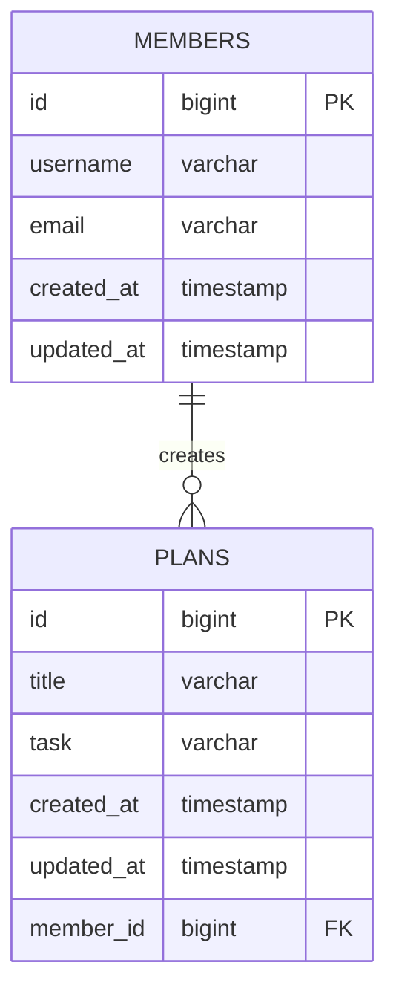

# 🗓️ Developing a Planner Application Using Spring Boot and JPA

## 💻 Introduction
- This project is an assignment designed to evaluate students' understanding of the online lecture.
- The application is developed as a personal project.
- The application is designed with a console-based user interface.

## 📆 Development Period
- **Study**: 08/12/2024 – 13/12/2024
- **Development**: 13/12/2024 – 19/12/2024

## 🛠️ Tech Stack
- Java 17
- Spring Boot 3.4.0
- Spring Data JPA
- MySQL Driver
- MySQL 9.1.0

## 🔗 ERD


### ERD Note
- The SQL database table name of `PLANS` is `plans2`.
- The SQL database table name of `MEMBERS` is `members2`.

## 📜 API Specification
### Basic Information
- Base URL (plan): /plans
- Base URL (member): /members
- Response Format: JSON
- Character Encoding: UTF-8

### API List

1. #### Member
| Method | URI             | Description          | Request Parameters  | Response Code |
|--------|-----------------|----------------------|---------------------|---------------|
| POST   | /members/signup | Create member        | username, email     | 201           |
| GET    | /members        | Read all members     |                     | 200           |
| GET    | /members/{id}   | Read specific member | id                  | 200           | 
| PUT    | /members/{id}   | Update member        | id, username, email | 200           |
| DELETE | /members/{id}   | Delete member        | id                  | 200           |

2. #### Plan
| Method | URI           | Description           | Request Parameters  | Response Code |
|--------|---------------|-----------------------|---------------------|---------------|
| POST   | /plans        | Create plan           | title, task, userId | 201           |
| GET    | /plans        | Read all plans        |                     | 200           |
| GET    | /plans/{id}   | Read specific plan    | id                  | 200           | 
| PATCH  | /plans/{id}   | Update plan partially | id, title, task     | 200           |
| DELETE | /plans/{id}   | Delete plan           | id                  | 200           |

### API Details
#### Request Body Details - Member
1. **`POST` Create Member**
    ```json
    {
        "username" : "사용자 이름",
        "email" : "사용자 이메일"
    }
    ```
   
2. **`PUT` Update Member**
    ```json
    {
        "username" : "수정하려는 사용자 이름",
        "email" : "수정하려는 사용자 이메일"
    }
    ```

#### Request Body Details - Plan
1. **`POST` Create Plan**
    ```json
    {
        "title" : "일정 제목",
        "task" : "일정 내용",
        "userId" : 1
    }
    ```

2. **`PATCH` Update Plan**
    ```json
    {
        "title" : "수정하려는 일정 제목",
        "task" : "수정하려는 일정 내용"
    }
    ```

#### Response Body Details - Member
1. **`GET` Read All Members**
    ```json
    [
        {
            "id" : 1,
            "username" : "사용자1 이름",
            "email" : "사용자1 이메일 "
        },
        {
            "id" : 2,
            "username" : "사용자2 이름",
            "email" : "사용자2 이메일"
        }
    ]
    ```

2. **`GET` Read Specific Member**
    ```json
    {
        "id" : 1,
        "username" : "사용자 이름",
        "email" : "사용자 이메일"
    }
    ```

3. **`PUT` Update Member**
    ```json
    {
        "id" : 1,
        "username" : "수정된 사용자 이름",
        "email" : "수정된 사용자 이메일"
    }
    ```

#### Response Body Details - Plan
1. **`CREATE` Create Plan**
    ```json
    {
        "id" : 1,
        "title" : "일정 제목",
        "task" : "일정 내용",
        "createdAt" : "2024-12-16 14:46:03",
        "updatedAt" : "2024-12-16 14:46:03",
        "member": {
            "id": 1,
            "username": "작성자 이름",
            "email": "작성자 이메일"
        }
    }
    ```
   
2. **`GET` Read All Plans**
    ```json
    [
        {
            "id" : 1,
            "title" : "일정1 제목",
            "task" : "일정1 내용",
            "createdAt" : "2024-12-16 14:46:03",
            "updatedAt" : "2024-12-16 14:46:03",
            "member": {
                "id": 1,
                "username": "일정1 작성자 이름",
                "email": "일정1 작성자 이메일"
            }
        },
        {
            "id" : 2,
            "title" : "일정2 제목",
            "task" : "일정2 내용",
            "createdAt" : "2024-12-16 14:54:29",
            "updatedAt" : "2024-12-16 14:56:52",
            "member": {
                "id": 2,
                "username": "일정2 작성자 이름",
                "email": "일정2 작성자 이메일"
            }
        },
        {
            "id" : 3,
            "title" : "일정3 제목",
            "task" : "일정3 내용",
            "createdAt" : "2024-12-16 14:54:30",
            "updatedAt" : "2024-12-16 14:54:30",
            "member": {
                "id": 1,
                "username": "일정3 작성자 이름",
                "email": "일정3 작성자 이메일"
            }
        }   
    ]
    ```

3. **`GET` Read Specific Plan**
    ```json
    {
        "id" : 1,
        "title" : "일정 제목",
        "task" : "일정 내용",
        "createdAt" : "2024-12-16 14:46:03",
        "updatedAt" : "2024-12-16 14:46:03",
        "member": {
            "id": 1,
            "username": "일정 작성자 이름",
            "email": "일정 작성자 이메일"
        }
    }
    ```

4. **`PATCH` Update Plan**
    ```json
    {
        "id" : 1,
        "title" : "수정된 일정 제목",
        "task" : "수정된 일정 내용",
        "createdAt" : "2024-12-16 14:46:04",
        "updatedAt" : "2024-12-16 15:03:31",
        "member": {
            "id": 1,
            "username": "일정 작성자 이름",
            "email": "일정 작성자 이메일"
        }
    }
    ``` 

### Error Response Code
| HTTP Status | Description              | Message Example                  |
|-------------|--------------------------|----------------------------------|
| 404         | Not Found                | "Id does not exist. Input id = " |
| 500         | Internal Server Error    | "Internal Server Error occurred" |

### Request Body Description
#### Field Information - Member
| Field Name | Data Type     | Mandatory Status | Description                                                                                               |
|------------|---------------|------------------|-----------------------------------------------------------------------------------------------------------|
| id         | Long          | Optional         | Identifier for each member  <br/> Required for **GET**, **PUT**, or **DELETE** requests                   |
| username   | String        | Mandatory        | User's name <br/> must be less than 4 characters                                                          |
| email      | String        | Mandatory        | User's email account                                                                                      |
| createdAt  | LocalDateTime | Not Included     | The timestamp when the plan is created  <br/> Automatically stored in the database upon creation          |
| updatedAt  | LocalDateTime | Not Included     | The timestamp when the plan is last updated  <br/> Automatically stored in the database upon modification |

#### Field Information - Plan
| Field Name | Data Type     | Mandatory Status | Description                                                                                               |
|------------|---------------|------------------|-----------------------------------------------------------------------------------------------------------|
| id         | Long          | Optional         | Identifier for each plan  <br/> Required for **GET**, **PATCH**, or **DELETE** requests                   |
| title      | String        | Mandatory        | Title of the plan <br/> must be less than 10 characters                                                   |
| task       | String        | Optional         | Detailed description of the plan  <br/> Should be an empty String(`""`) when the value is null            |
| userId     | Long          | Mandatory        | Identifier of user <br/> Required for **CREATE** request                                                  |
| createdAt  | LocalDateTime | Not Included     | The timestamp when the plan is created  <br/> Automatically stored in the database upon creation          |
| updatedAt  | LocalDateTime | Not Included     | The timestamp when the plan is last updated  <br/> Automatically stored in the database upon modification |

##  📊 Database Schema
### 1. MEMBERS
```sql
CREATE TABLE members2
(
   id BIGINT AUTO_INCREMENT COMMENT '사용자 식별자' PRIMARY KEY,
   username VARCHAR(16) NOT NULL COMMENT '사용자 이름',
   email VARCHAR(128) NOT NULL COMMENT '사용자 이메일',
   created_at TIMESTAMP DEFAULT CURRENT_TIMESTAMP NOT NULL COMMENT '생성일',
   updated_at TIMESTAMP NOT NULL ON UPDATE CURRENT_TIMESTAMP COMMENT '수정일'
);

```

### 2. PLANS
```sql
CREATE TABLE plans2
(
   id BIGINT AUTO_INCREMENT COMMENT '일정 식별자' PRIMARY KEY,
   member_id BIGINT NOT NULL,
   title VARCHAR(16) NOT NULL COMMENT '일정 제목',
   task VARCHAR(512) NULL COMMENT '일정 내용',
   created_at TIMESTAMP DEFAULT CURRENT_TIMESTAMP NOT NULL COMMENT '생성일',
   updated_at TIMESTAMP NOT NULL ON UPDATE CURRENT_TIMESTAMP COMMENT '수정일',
   CONSTRAINT fk__plans2__member_id 
       FOREIGN KEY (member_id) REFERENCES members2 (id)
);
```

## 🚀 Key Features
- Implement CRUD functionality for plans and members.
- Store data in an SQL database using JPA.
- Resolve name duplication issues by using the user's identifier.

## 🔍 Characteristics
- Separate the 3-layer architecture and DTOs into different packages by URL

## 📜 More Information
- [Visit Development Journal](https://writingforever162.tistory.com)
- [Visit Troubleshooting Records](https://writingforever162.tistory.com/category/Troubleshooting%3A%20%EB%AC%B4%EC%97%87%EC%9D%B4%20%EB%AC%B8%EC%A0%9C%EC%98%80%EB%8A%94%EA%B0%80%3F)