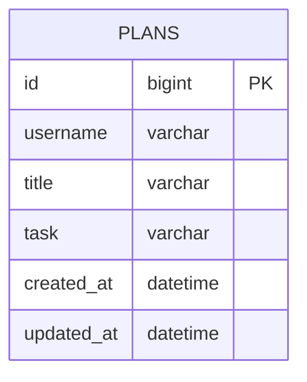

# 🗓️ Developing a Planner Application Using Spring Boot and JPA (Level One)

## 💻 Introduction

- This project is an assignment designed to evaluate students' understanding of the online lecture.
- The application is developed as a personal project.
- The application is designed with a console-based user interface.

## 📆 Development Period

- **Study**: 08/12/2024 – 13/12/2024
- **Development**: 13/12/2024 – 19/12/2024

## 🛠️ Tech Stack

- Java 17
- Spring Boot 3.4.0
- Spring Data JPA
- MySQL Driver
- MySQL 9.1.0
- Lombok

## 🔗 ERD



### ERD Note

- The SQL database table name of `PLANS` is `plans`.

## 📜 API Specification

### Basic Information

- Base URL: /plans
- Response Format: JSON
- Character Encoding: UTF-8

### API List

| Method | URI         | Description        | Request Parameters    | Response Code |
|--------|-------------|--------------------|-----------------------|---------------|
| POST   | /plans      | Create plan        | username, title, task | 201           |
| GET    | /plans      | Read all plans     |                       | 200           |
| GET    | /plans/{id} | Read specific plan | id                    | 200           |
| PATCH  | /plans/{id} | Update plan        | id, title, task       | 200           |
| DELETE | /plans/{id} | Delete plan        | id                    | 200           |

### API Details

#### Request Body Details

1. **`POST` Create Plan**
    ```json
    {
        "username" : "작성자 이름",
        "title" : "일정 제목",
        "task" : "일정 내용"
    }
    ```

2. **`PATCH` Update Plan**
    ```json
    {
        "title" : "수정하려는 일정 제목",
        "task" : "수정하려는 일정 내용"
    }
    ```

#### Response Body Details

1. **`CREATE` Create Plan**
    ```json
    {
        "id" : 1,
        "username" : "작성자 이름",
        "title" : "일정 제목",
        "task" : "일정 내용"
    }
    ```

2. **`GET` Read All Plans**
    ```json
    [
        {
            "id" : 1,
            "username" : "작성자 이름",
            "title" : "일정 제목",
            "task" : "일정 내용"
        },
        {
            "id" : 2,
            "username" : "작성자 이름2",
            "title" : "일정 제목2",
            "task" : "일정 내용2"
        }
    ]
    ```

3. **`GET` Read Specific Plan**
    ```json
    {
        "id" : 1,
        "username" : "작성자 이름",
        "title" : "일정 제목",
        "task" : "일정 내용"
    }
    ```

4. **`PATCH` Update Plan**
    ```json
    {
        "id" : 1,
        "username" : "작성자 이름",
        "title" : "수정된 일정 제목",
        "task" : "수정된 일정 내용"
    }
    ```

### Error Response Code

| HTTP Status | Description           | Message Example                  |
|-------------|-----------------------|----------------------------------|
| 404         | Not Found             | "Id does not exist. Input id = " |
| 500         | Internal Server Error | "Internal Server Error occurred" |

### Request Body Description

#### Field Information

| Field Name | Data Type     | Mandatory Status | Description                                                                                               |
|------------|---------------|------------------|-----------------------------------------------------------------------------------------------------------|
| id         | Long          | Optional         | Identifier for each plan  <br/> Required for **GET**, **PATCH**, or **DELETE** requests                   |
| username   | String        | Mandatory        | User's name <br/> must be less than 4 characters                                                          |
| title      | String        | Mandatory        | Title of the plan <br/> must be less than 10 characters                                                   |
| task       | String        | Optional         | Detailed description of the plan  <br/> Should be an empty String(`""`) when the value is null            |
| createdAt  | LocalDateTime | Not Included     | The timestamp when the plan is created  <br/> Automatically stored in the database upon creation          |
| updatedAt  | LocalDateTime | Not Included     | The timestamp when the plan is last updated  <br/> Automatically stored in the database upon modification |

## 📊 Database Schema

```sql
CREATE TABLE plans
(
    id         BIGINT AUTO_INCREMENT COMMENT '일정 식별자'
        PRIMARY KEY,
    username   VARCHAR(50) NOT NULL COMMENT '작성자 이름',
    title      VARCHAR(50) NOT NULL COMMENT '일정 제목',
    task       VARCHAR(100) NULL COMMENT '일정 내용',
    created_at DATETIME(6)  NOT NULL COMMENT '일정 생성일',
    updated_at DATETIME(6)  NOT NULL COMMENT '일정 수정일'
);
```

## 🚀 Key Features

- Implement CRUD functionality for plans.
- Save data in an SQL database using JPA.

## 📜 More Information

- [Visit Development Journal](https://writingforever162.tistory.com)
- [Visit Troubleshooting Records](https://writingforever162.tistory.com/category/Troubleshooting%3A%20%EB%AC%B4%EC%97%87%EC%9D%B4%20%EB%AC%B8%EC%A0%9C%EC%98%80%EB%8A%94%EA%B0%80%3F)